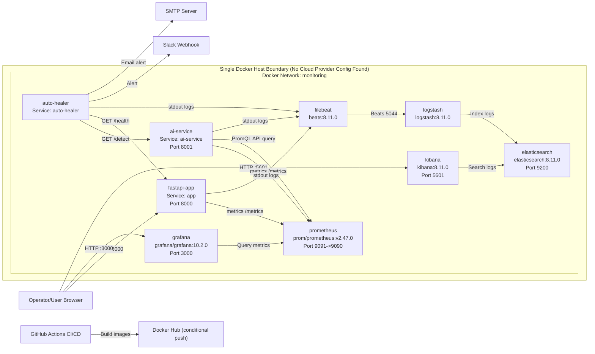
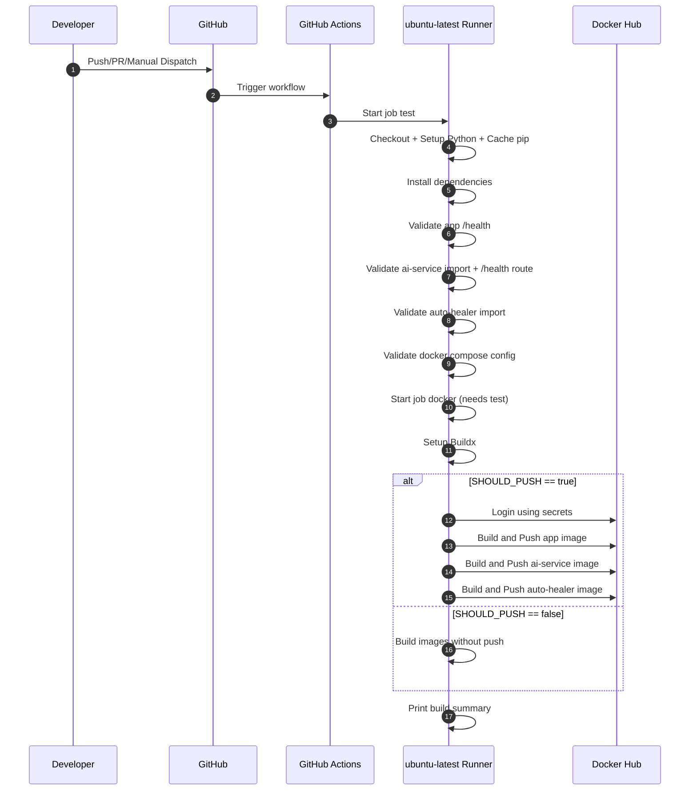
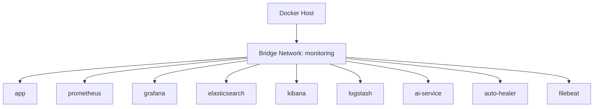
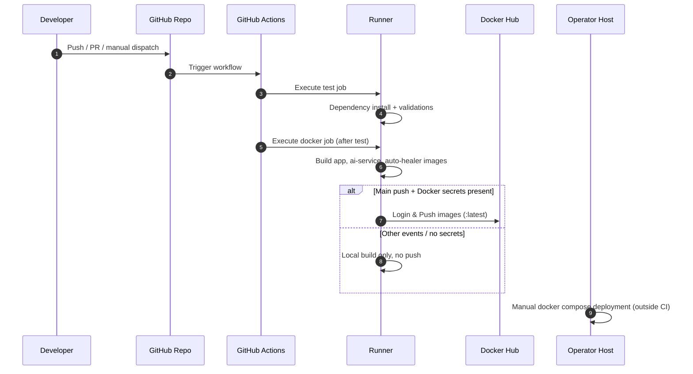
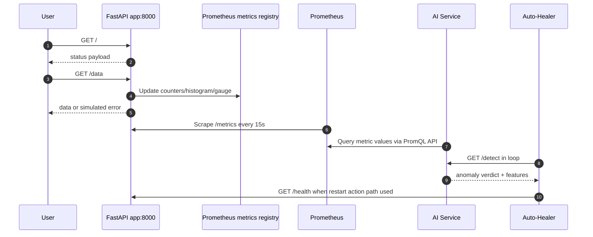
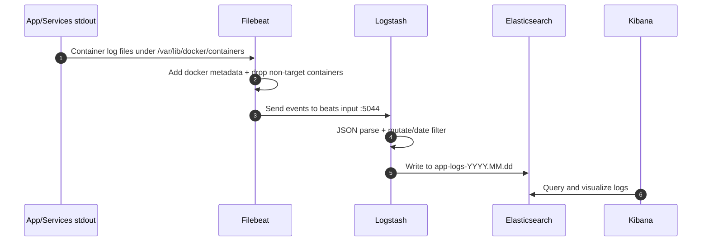
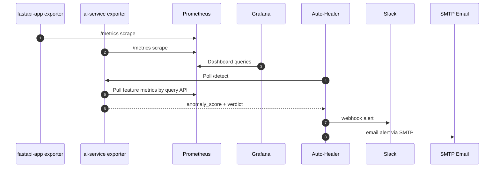
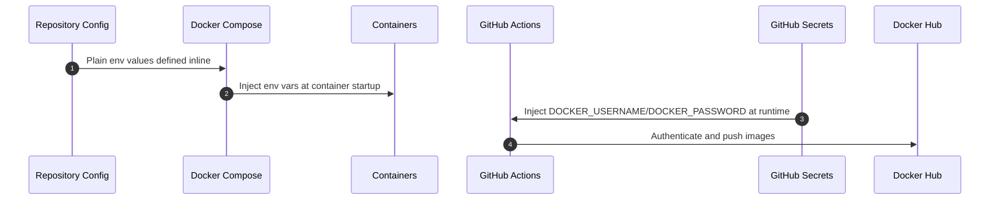
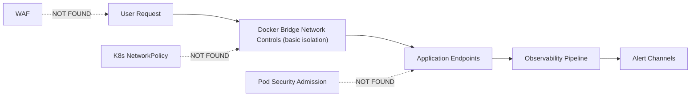

# AI-powered Automated System Monitoring and Recovery — Complete DevOps Architecture Documentation

## 1. Executive Summary (Urdu + English Mix)

Ye system ek Docker Compose based **self-monitoring aur self-healing platform** hai jo application telemetry collect karta hai, anomaly detect karta hai, aur remediation alerts/actions trigger karta hai. Core stack mein FastAPI app, Prometheus, Grafana, ELK (Elasticsearch/Logstash/Kibana), AI anomaly detection service, aur auto-healer service shamil hain. `📁 docker-compose.yml:19` `📁 docker-compose.yml:38` `📁 docker-compose.yml:58` `📁 docker-compose.yml:73` `📁 docker-compose.yml:91` `📁 docker-compose.yml:107` `📁 docker-compose.yml:123` `📁 docker-compose.yml:150` `📁 docker-compose.yml:175`

Ye platform DevOps/SRE workflows ke liye bana hua lagta hai jahan objective hai:
- app health monitor karna `📁 app/main.py:81`
- app metrics expose karna `📁 app/main.py:88`
- Prometheus se metrics pull karke anomaly detect karna `📁 ai-service/main.py:138` `📁 ai-service/main.py:325`
- anomaly par Slack/Email alert aur restart attempt karna `📁 auto-healer/main.py:80` `📁 auto-healer/main.py:86` `📁 auto-healer/main.py:112`

Agar ye system down ho jaye to:
- app observability khatam ho jayegi (metrics/logs visibility drop) `📁 monitoring/prometheus.yml:7` `📁 monitoring/filebeat.yml:1` `📁 monitoring/logstash.conf:32`
- anomaly detection & auto-healing ruk jayegi `📁 auto-healer/main.py:158` `📁 ai-service/main.py:325`
- centralized troubleshooting (Kibana) unavailable hogi `📁 docker-compose.yml:91`

---

## 2. Technology Radar & Inventory

| Category | Technology | Version (from code) | Config File Path | Purpose in System |
|---|---|---|---|---|
| Cloud | Cloud provider integration | NOT FOUND | N/A | No AWS/GCP/Azure resource definitions present |
| IaC | Terraform | NOT FOUND | N/A | No `.tf` files found |
| IaC | Ansible | NOT FOUND | N/A | No playbooks/inventory found |
| CI/CD | GitHub Actions | `actions/checkout@v4`, `setup-python@v5`, `setup-buildx-action@v3`, `login-action@v3`, `build-push-action@v6` | `.github/workflows/main.yml` | Validation + image build/push pipeline |
| Containers | Dockerfile (app) | Base `python:3.11-slim` | `app/Dockerfile` | Build runtime image for FastAPI app |
| Containers | Dockerfile (ai-service) | Base `python:3.11-slim` | `ai-service/Dockerfile` | Build runtime image for AI anomaly service |
| Containers | Dockerfile (auto-healer) | Base `python:3.11-slim` | `auto-healer/Dockerfile` | Build runtime image for auto-healer |
| Orchestration | Docker Compose | Compose `3.8` | `docker-compose.yml` | Multi-container orchestration on single host |
| Monitoring | Prometheus | `prom/prometheus:v2.47.0` | `docker-compose.yml`, `monitoring/prometheus.yml` | Scrape & store metrics |
| Monitoring | Grafana | `grafana/grafana:10.2.0` | `docker-compose.yml` | Dashboard visualization |
| Logging | Filebeat | `docker.elastic.co/beats/filebeat:8.11.0` | `docker-compose.yml`, `monitoring/filebeat.yml` | Collect container logs |
| Logging | Logstash | `docker.elastic.co/logstash/logstash:8.11.0` | `docker-compose.yml`, `monitoring/logstash.conf` | Parse/transform logs |
| Logging | Elasticsearch | `docker.elastic.co/elasticsearch/elasticsearch:8.11.0` | `docker-compose.yml` | Log storage/indexing |
| Logging | Kibana | `docker.elastic.co/kibana/kibana:8.11.0` | `docker-compose.yml` | Log search/visualization |
| Secrets | GitHub Actions Secrets | Names only (`DOCKER_USERNAME`, `DOCKER_PASSWORD`) | `.github/workflows/main.yml` | Conditional registry auth & push |
| Secrets | Environment variables in Compose | Inline plaintext values | `docker-compose.yml` | Runtime config/secrets injection |
| Networking | Docker bridge network | `monitoring` network | `docker-compose.yml` | East-west connectivity between services |
| Scripting | Python | FastAPI + automation scripts | `app/main.py`, `ai-service/main.py`, `auto-healer/main.py` | App logic, AI logic, healing loop |
| Security Scanners | Trivy / Checkov / Snyk / tfsec / OPA | NOT FOUND | N/A | No scanner integration in pipeline |

Supporting package/runtime versions from project files:
- `fastapi==0.104.1` `📁 app/requirements.txt:1` `📁 ai-service/requirements.txt:1`
- `uvicorn==0.24.0` `📁 app/requirements.txt:2` `📁 ai-service/requirements.txt:2`
- `prometheus-client==0.19.0` `📁 app/requirements.txt:3` `📁 ai-service/requirements.txt:6`
- `requests==2.31.0` `📁 app/requirements.txt:4` `📁 ai-service/requirements.txt:5` `📁 auto-healer/requirements.txt:1`
- `scikit-learn==1.3.2` `📁 ai-service/requirements.txt:3`
- `numpy==1.26.2` `📁 ai-service/requirements.txt:4`
- `joblib==1.5.3` `📁 ai-service/requirements.txt:7`

---

## 3. High-Level Architecture Diagram

> Note: Cloud/VPC/Subnet/LB/Ingress/K8s resources are not defined in codebase. Diagram represents **actual implemented Compose topology** and explicitly marks missing cloud boundary components.

Evidence:
- Services and network `📁 docker-compose.yml:4` `📁 docker-compose.yml:14`
- Prometheus scrape paths `📁 monitoring/prometheus.yml:14` `📁 monitoring/prometheus.yml:20`
- Auto-healer interactions `📁 auto-healer/main.py:171` `📁 auto-healer/main.py:90`
- Log pipeline `📁 monitoring/filebeat.yml:22` `📁 monitoring/logstash.conf:33`
- CI/Docker hub integration `📁 .github/workflows/main.yml:100`

---

## 4. CI/CD Pipeline Deep Dive & Flow

### Pipeline Files Found
- `📁 .github/workflows/main.yml:1`

### CI/CD Flow (Sequence)

### Pipeline Stage Table (Exhaustive)

| Stage Name | Trigger | Runner/Agent | Actions (Step-by-Step) | File:Line | Artifacts Produced |
|---|---|---|---|---|---|
| Workflow trigger | `push main`, `pull_request main`, `workflow_dispatch` | GitHub Actions controller | Evaluate event filters and start jobs | `.github/workflows/main.yml:3-8` | Workflow run metadata |
| `test` job start | Workflow trigger | `ubuntu-latest` | Allocate runner VM | `.github/workflows/main.yml:11-13` | Runner workspace |
| Checkout code | Within `test` | `ubuntu-latest` | `actions/checkout@v4` | `.github/workflows/main.yml:16-17` | Source tree checkout |
| Setup Python | Within `test` | `ubuntu-latest` | `actions/setup-python@v5` with Python 3.11 + pip cache for 3 requirements files | `.github/workflows/main.yml:19-27` | Python runtime + pip cache |
| Install dependencies | Within `test` | `ubuntu-latest` | Upgrade pip, install app/ai-service/auto-healer reqs, pin `httpx<0.28` | `.github/workflows/main.yml:29-35` | Installed deps in runner |
| Validate app endpoint | Within `test` | `ubuntu-latest` | Inline Python: import app, request `/health`, assert status + payload | `.github/workflows/main.yml:37-53` | Validation result in logs |
| Validate ai-service | Within `test` | `ubuntu-latest` | Inline Python: import app object and assert `/health` route exists | `.github/workflows/main.yml:55-67` | Validation result in logs |
| Validate auto-healer import | Within `test` | `ubuntu-latest` | Inline Python import test | `.github/workflows/main.yml:69-79` | Validation result in logs |
| Validate compose syntax | Within `test` | `ubuntu-latest` | `docker compose config` | `.github/workflows/main.yml:81-82` | Parsed compose result |
| `docker` job gate | After `test` success | `ubuntu-latest` | `needs: test`; define `SHOULD_PUSH` and `IMAGE_REPO` env | `.github/workflows/main.yml:84-92` | Computed env values |
| Checkout code | Within `docker` | `ubuntu-latest` | `actions/checkout@v4` | `.github/workflows/main.yml:94-95` | Source tree checkout |
| Setup Buildx | Within `docker` | `ubuntu-latest` | `docker/setup-buildx-action@v3` | `.github/workflows/main.yml:97-98` | Buildx builder |
| Docker Hub login | Conditional in `docker` | `ubuntu-latest` | Login using `secrets.DOCKER_USERNAME` and `secrets.DOCKER_PASSWORD` | `.github/workflows/main.yml:100-106` | Registry auth session |
| Build app image | Within `docker` | `ubuntu-latest` | Build context `./app`; push conditional; tag `${IMAGE_REPO}/ai-healing-app:latest` | `.github/workflows/main.yml:107-113` | App image |
| Build ai-service image | Within `docker` | `ubuntu-latest` | Build context `./ai-service`; push conditional; tag `${IMAGE_REPO}/ai-healing-ai-service:latest` | `.github/workflows/main.yml:114-120` | AI image |
| Build auto-healer image | Within `docker` | `ubuntu-latest` | Build context `./auto-healer`; push conditional; tag `${IMAGE_REPO}/ai-healing-auto-healer:latest` | `.github/workflows/main.yml:121-127` | Auto-healer image |
| Build summary | End of `docker` | `ubuntu-latest` | Print CI summary values | `.github/workflows/main.yml:128-136` | Human-readable logs |

### Deployment Strategy
- **No deployment stage configured** (no SSH, Helm, kubectl, ECS, Terraform apply, ArgoCD trigger). `📁 .github/workflows/main.yml:1-137`
- Effective strategy = **Build/Push only**.

### Variables & Secrets Injection
- Pipeline secrets injected via `secrets.*` context in env and login step. `📁 .github/workflows/main.yml:90-91` `📁 .github/workflows/main.yml:104-105`
- Runtime service secrets/config injected through Compose `environment`. `📁 docker-compose.yml:63` `📁 docker-compose.yml:128` `📁 docker-compose.yml:153`

---

## 5. Infrastructure as Code (IaC) State Map

### Providers, Backends, State Locking

| Item | Status | Evidence |
|---|---|---|
| Terraform providers | NOT FOUND | No `.tf` files in repository |
| Terraform backend/state | NOT FOUND | No backend blocks |
| Terraform locking | NOT FOUND | No DynamoDB/GCS lock config |
| Pulumi/CloudFormation/CDK | NOT FOUND | No corresponding manifests |
| Ansible inventory/playbooks | NOT FOUND | No ansible files |

### Resource Table (Exhaustive for Existing Declarative Infra: Docker Compose + Monitoring Config)

| Resource Type | Name | File:Line | Depends On | Variables Used |
|---|---|---|---|---|
| Compose version | 3.8 | `docker-compose.yml:1` | none | none |
| Docker network | `monitoring` bridge | `docker-compose.yml:4-6` | none | none |
| Docker volume | `elasticsearch-data` | `docker-compose.yml:9-10` | none | none |
| Docker volume | `prometheus-data` | `docker-compose.yml:11` | none | none |
| Docker volume | `ai-models` | `docker-compose.yml:12` | none | none |
| Service | `app` | `docker-compose.yml:19-34` | network `monitoring` | healthcheck endpoint `/health` |
| Service | `prometheus` | `docker-compose.yml:38-54` | network + volume + mounted config | `--storage.tsdb.retention.time=15d` |
| Service | `grafana` | `docker-compose.yml:58-69` | network | `GF_SECURITY_ADMIN_USER`, `GF_SECURITY_ADMIN_PASSWORD` |
| Service | `elasticsearch` | `docker-compose.yml:73-87` | network + volume | `discovery.type`, `xpack.security.enabled`, `ES_JAVA_OPTS` |
| Service | `kibana` | `docker-compose.yml:91-103` | `elasticsearch` | `ELASTICSEARCH_HOSTS` |
| Service | `logstash` | `docker-compose.yml:107-119` | `elasticsearch` + mounted pipeline config | `LS_JAVA_OPTS` |
| Service | `ai-service` | `docker-compose.yml:123-146` | `prometheus`, `app`, volume | `PROMETHEUS_URL`, model/drift/retrain envs |
| Service | `auto-healer` | `docker-compose.yml:150-169` | `ai-service` | `AI_SERVICE_URL`, SMTP/Slack envs |
| Service | `filebeat` | `docker-compose.yml:175-192` | `logstash`, `elasticsearch` | filebeat command + docker socket mounts |
| Prom scrape job | `prometheus` | `monitoring/prometheus.yml:9-11` | running Prometheus target | none |
| Prom scrape job | `fastapi-app` | `monitoring/prometheus.yml:14-17` | app service reachable | `metrics_path` |
| Prom scrape job | `ai-service` | `monitoring/prometheus.yml:20-23` | ai-service reachable | `metrics_path` |
| Filebeat input | docker container logs | `monitoring/filebeat.yml:1-5` | docker log files mounted | log path glob |
| Filebeat processor | add docker metadata | `monitoring/filebeat.yml:6-9` | docker socket mounted | socket path |
| Filebeat processor | drop_event filter | `monitoring/filebeat.yml:10-20` | container names | filtering conditions |
| Filebeat output | logstash hosts | `monitoring/filebeat.yml:22-23` | logstash service reachable | host:port |
| Logstash input | beats 5044 | `monitoring/logstash.conf:4-8` | filebeat forwarder | port |
| Logstash filter | json parse + date mutate | `monitoring/logstash.conf:11-29` | incoming message format | field names |
| Logstash output | elasticsearch index | `monitoring/logstash.conf:32-36` | Elasticsearch reachable | index pattern |

### Networking Map

> VPC/Subnet/Route Table/IGW/NAT definitions are absent. Existing network is Docker bridge.

Security group rules: **NOT FOUND** (no cloud SG/NACL resources defined).

### Kubernetes Manifests

| Kind | Found? | Evidence |
|---|---|---|
| Deployment | No | No K8s manifests |
| Service | No | No K8s manifests |
| Ingress | No | No K8s manifests |
| ConfigMap | No | No K8s manifests |
| Secret | No | No K8s manifests |
| RBAC | No | No K8s manifests |
| HPA/PDB | No | No K8s manifests |

---

## 6. Container & Image Analysis

### Dockerfile Analysis (Every Dockerfile)

| Dockerfile | Base Image | Multi-stage | Runs as Root? | Installed Packages | Exposed Port | Entrypoint/CMD | Layer Optimization Notes |
|---|---|---|---|---|---|---|---|
| `app/Dockerfile` | `python:3.11-slim` | No | Yes (no `USER`) | apt: `gcc`; pip: fastapi/uvicorn/prometheus-client/requests | `8000` | `python -m uvicorn main:app --host 0.0.0.0 --port 8000` | Copies full context after installs; no non-root hardening |
| `ai-service/Dockerfile` | `python:3.11-slim` | No | Yes (no `USER`) | apt: `gcc`; pip: fastapi/uvicorn/scikit-learn/numpy/requests/prometheus-client/joblib | `8001` | `python -m uvicorn main:app --host 0.0.0.0 --port 8001` | Single-stage heavy runtime; no slim runtime stage |
| `auto-healer/Dockerfile` | `python:3.11-slim` | No | Yes (no `USER`) | pip: requests | none | `python main.py` | Simple image, but still root by default |

Evidence:
- `📁 app/Dockerfile:1` `📁 app/Dockerfile:5` `📁 app/Dockerfile:9` `📁 app/Dockerfile:17` `📁 app/Dockerfile:19`
- `📁 ai-service/Dockerfile:1` `📁 ai-service/Dockerfile:5` `📁 ai-service/Dockerfile:10` `📁 ai-service/Dockerfile:21` `📁 ai-service/Dockerfile:23`
- `📁 auto-healer/Dockerfile:1` `📁 auto-healer/Dockerfile:5` `📁 auto-healer/Dockerfile:9`

### Docker Compose Details

| Area | Implementation |
|---|---|
| Services | 9 services defined (`app`, `prometheus`, `grafana`, `elasticsearch`, `kibana`, `logstash`, `ai-service`, `auto-healer`, `filebeat`) `📁 docker-compose.yml:14` |
| Networks | 1 bridge network `monitoring` `📁 docker-compose.yml:4-6` |
| Volumes | `elasticsearch-data`, `prometheus-data`, `ai-models` `📁 docker-compose.yml:9-12` |
| Healthchecks | Only `app` has explicit healthcheck `📁 docker-compose.yml:26-32` |
| Restart policies | `unless-stopped` across services `📁 docker-compose.yml:33` |
| depends_on | Used for startup order only (`kibana`, `logstash`, `ai-service`, `auto-healer`, `filebeat`) `📁 docker-compose.yml:98` `📁 docker-compose.yml:114` `📁 docker-compose.yml:140` `📁 docker-compose.yml:165` `📁 docker-compose.yml:187` |
| Resource limits | NOT FOUND (no CPU/memory limits in compose) |
| Helm/Kustomize | NOT FOUND |

---

## 7. DATA FLOW ANALYSIS (The Core Request)

### 7.1 Deployment Data Flow

Data storage/transform/archival points:
- Source code in GitHub -> transformed into container images in CI build steps `📁 .github/workflows/main.yml:107-127`
- Image archival in Docker Hub only when `SHOULD_PUSH=true` `📁 .github/workflows/main.yml:90-91`
- No automated deploy artifact promotion/history policy found.

### 7.2 Application Request Flow

Flow evidence:
- App endpoints and metric writes `📁 app/main.py:50` `📁 app/main.py:56` `📁 app/main.py:74` `📁 app/main.py:88`
- Prometheus scrape config `📁 monitoring/prometheus.yml:4` `📁 monitoring/prometheus.yml:14`
- AI queries Prometheus API `📁 ai-service/main.py:138-147`
- Auto-healer polling loop `📁 auto-healer/main.py:169-177`

### 7.3 Log Data Flow

Storage/transform/destruction:
- Raw logs stored by Docker engine log files (host path mount) `📁 docker-compose.yml:186`
- Transformed in Logstash filter stage `📁 monitoring/logstash.conf:11-29`
- Stored in Elasticsearch daily index `📁 monitoring/logstash.conf:35`
- Retention for Elasticsearch indices: **NOT FOUND**

### 7.4 Metric Data Flow

Notes:
- Alertmanager integration is **NOT FOUND**; alerting is application-level via auto-healer functions. `📁 auto-healer/main.py:33` `📁 auto-healer/main.py:53`

### 7.5 Secret Data Flow

Secret lifecycle:
- Secret creation/source: partly hardcoded in compose, partly GitHub secret store `📁 docker-compose.yml:65` `📁 docker-compose.yml:161` `📁 .github/workflows/main.yml:104-105`
- Runtime injection: container env and CI env `📁 docker-compose.yml:63` `📁 .github/workflows/main.yml:89`
- Rotation/archival/destruction policies: **NOT FOUND**

---

## 8. Observability Matrix (Monitoring, Logging, Tracing)

### Metrics Table

| Metric Name | Source | Scrape Interval | Retention | `📁 file:line` |
|---|---|---|---|---|
| `app_requests_total{method,endpoint,status}` | `fastapi-app` custom Counter | 15s global scrape | 15d Prometheus TSDB | `📁 app/main.py:31` `📁 monitoring/prometheus.yml:4` `📁 docker-compose.yml:50` |
| `app_request_latency_seconds` | `fastapi-app` Histogram | 15s global scrape | 15d Prometheus TSDB | `📁 app/main.py:38` `📁 monitoring/prometheus.yml:4` `📁 docker-compose.yml:50` |
| `app_error_rate` | `fastapi-app` Gauge | 15s global scrape | 15d Prometheus TSDB | `📁 app/main.py:44` `📁 monitoring/prometheus.yml:4` `📁 docker-compose.yml:50` |
| `prometheus` internal metrics | Prometheus self scrape | 15s | 15d | `📁 monitoring/prometheus.yml:9` `📁 docker-compose.yml:50` |
| `ai-service` exposed metrics endpoint | ai-service `/metrics` | 15s | 15d | `📁 ai-service/main.py:393` `📁 monitoring/prometheus.yml:20` `📁 docker-compose.yml:50` |

### Alerting Rules Table

| Alert Name | Condition | Severity | Notification Channel | `📁 file:line` |
|---|---|---|---|---|
| Prometheus rule alerts | NOT FOUND | N/A | N/A | No rule files present |
| `Anomaly detected` alert | `handle_anomaly` called when 3 consecutive anomalies happen | Critical | Slack + Email (if configured) | `📁 auto-healer/main.py:194-196` `📁 auto-healer/main.py:133` |
| `High error rate restart trigger` | `error_rate > 30` and cooldown passed | Warning/Critical context | Slack + Email + restart action | `📁 auto-healer/main.py:136-142` |
| `High latency alert` | `avg_latency > 0.5` and cooldown passed | Warning | Slack + Email | `📁 auto-healer/main.py:144-155` |

### Log Pipeline Details

| Stage | Implementation | `📁 file:line` |
|---|---|---|
| Log generation | App writes structured JSON logs via custom formatter | `📁 app/main.py:11-20` |
| Collection | Filebeat docker input reads `/var/lib/docker/containers/*/*.log` | `📁 monitoring/filebeat.yml:1-5` |
| Enrichment | `add_docker_metadata` processor | `📁 monitoring/filebeat.yml:6-9` |
| Filtering | Keep only `fastapi-app`, `ai-service`, `auto-healer` | `📁 monitoring/filebeat.yml:10-20` |
| Transport | Filebeat -> Logstash host `logstash:5044` | `📁 monitoring/filebeat.yml:22-23` |
| Parsing | Logstash `json` filter on field `message` + fallback parse error flag | `📁 monitoring/logstash.conf:13-21` |
| Timestamp handling | `date` filter using `time` field | `📁 monitoring/logstash.conf:25-28` |
| Storage | Elasticsearch index `app-logs-%{+YYYY.MM.dd}` | `📁 monitoring/logstash.conf:33-36` |
| Visualization | Kibana service connected to Elasticsearch | `📁 docker-compose.yml:91-103` |
| Log retention policy | NOT FOUND | No ILM/retention settings found |

Tracing instrumentation: **NOT FOUND**.

---

## 9. Security, Compliance & Secrets Audit

### Security Layer Flow

### Secrets Inventory Table

| Secret Name | Storage Location | Access Method | Rotation Policy | Exposed in Plain Text? (YES/NO - Flag 🔴) | `📁 file:line` |
|---|---|---|---|---|---|
| `GF_SECURITY_ADMIN_USER` | Compose env | Container env var injection | NOT FOUND | YES (non-sensitive username) | `📁 docker-compose.yml:64` |
| `GF_SECURITY_ADMIN_PASSWORD` | Compose env | Container env var injection | NOT FOUND | 🔴 YES | `📁 docker-compose.yml:65` |
| `EMAIL_USERNAME` | Compose env | Container env var injection | NOT FOUND | 🔴 YES | `📁 docker-compose.yml:160` |
| `EMAIL_PASSWORD` | Compose env | Container env var injection | NOT FOUND | 🔴 YES | `📁 docker-compose.yml:161` |
| `ALERT_FROM_EMAIL` | Compose env | Container env var injection | NOT FOUND | YES | `📁 docker-compose.yml:162` |
| `ALERT_TO_EMAIL` | Compose env | Container env var injection | NOT FOUND | YES | `📁 docker-compose.yml:163` |
| `SLACK_WEBHOOK` | Compose env placeholder | Auto-healer reads env -> HTTP POST | NOT FOUND | Potentially YES when set | `📁 docker-compose.yml:157` `📁 auto-healer/main.py:19` `📁 auto-healer/main.py:47` |
| `DOCKER_USERNAME` | GitHub Actions secret store | Injected in workflow runtime | Managed by GitHub settings | NO in repo file content (referenced only) | `📁 .github/workflows/main.yml:90-91` `📁 .github/workflows/main.yml:104` |
| `DOCKER_PASSWORD` | GitHub Actions secret store | Injected in workflow runtime | Managed by GitHub settings | NO in repo file content (referenced only) | `📁 .github/workflows/main.yml:90` `📁 .github/workflows/main.yml:105` |

### Security Tools Integrated

| Tool | Integrated? | Where in Pipeline | Evidence |
|---|---|---|---|
| Trivy | No | N/A | No scanner step in workflow |
| Checkov | No | N/A | No scanner step in workflow |
| tfsec | No | N/A | No scanner step in workflow |
| Snyk | No | N/A | No scanner step in workflow |
| OPA/Conftest | No | N/A | No policy step in workflow |
| Falco/Sysdig runtime security | No | N/A | No service/config present |

Additional security findings:
- Elasticsearch auth/security explicitly disabled. `📁 docker-compose.yml:80`
- Containers run as root (no `USER` in Dockerfiles). `📁 app/Dockerfile:1-19` `📁 ai-service/Dockerfile:1-23` `📁 auto-healer/Dockerfile:1-9`
- No TLS config for internal services. `📁 docker-compose.yml:19-192`
- No `.gitignore` file detected in repository scan (cannot confirm ignore protections for `.env`). 

---

## 10. Automation vs Manual Matrix

| Task | Automated? (Yes/No) | Tool Used | Trigger | `📁 file:line` |
|---|---|---|---|---|
| Code validation tests | Yes | GitHub Actions `test` job | push/PR/manual dispatch | `📁 .github/workflows/main.yml:11-83` |
| Python dependency install in CI | Yes | `pip` in workflow | On `test` job run | `📁 .github/workflows/main.yml:29-35` |
| Docker image build | Yes | `docker/build-push-action` | On `docker` job run after test | `📁 .github/workflows/main.yml:84-127` |
| Docker image push | Yes (conditional) | Docker login + build-push action | Only main push + secrets present | `📁 .github/workflows/main.yml:90-91` `📁 .github/workflows/main.yml:100-106` |
| Runtime orchestration startup | Yes | Docker Compose | Manual operator command (`docker compose up`) | `📁 docker-compose.yml:1-192` |
| App healthcheck probing | Yes | Docker healthcheck | Every 30s in container runtime | `📁 docker-compose.yml:26-32` |
| Metric scraping | Yes | Prometheus | Every 15s | `📁 monitoring/prometheus.yml:4-5` |
| AI scheduled retraining | Yes | Background thread loop | Every `RETRAIN_INTERVAL_HOURS` (min 300s cadence logic) | `📁 ai-service/main.py:291-296` |
| Anomaly detection polling | Yes | Auto-healer loop | Every `CHECK_INTERVAL` seconds | `📁 auto-healer/main.py:169-217` |
| Slack alert dispatch | Yes (if configured) | `requests.post` webhook | On anomaly/remediation condition | `📁 auto-healer/main.py:33-50` |
| Email alert dispatch | Yes (if configured) | SMTP (`smtplib`) | On anomaly/remediation condition | `📁 auto-healer/main.py:53-77` |
| **Deployment to environment** | **No** | **Manual** | **Operator-driven** | `📁 .github/workflows/main.yml:1-137` |
| **Rollback orchestration** | **No** | **Manual** | **Operator-driven** | Not implemented |
| **Backup jobs (Prometheus/Elasticsearch/models)** | **No** | **Manual** | **Operator-driven** | No backup config files |
| **Secret rotation** | **No** | **Manual** | **Operator-driven** | No rotation automation |
| **Vulnerability scanning** | **No** | **Manual / absent** | **Not configured** | No scanner steps/services |

> **Critical Manual Risks:** **Deployment**, **Rollback**, **Backup/Restore**, **Secret Rotation**, **Security Scanning** are manual or missing.

---

## 11. Gaps, Risks & "What If" Scenarios

### 🔴 Critical Risks

- 🔴 Plaintext credential exposure in repo config:
  - Grafana admin password `📁 docker-compose.yml:65`
  - Email password `📁 docker-compose.yml:161`
- 🔴 Elasticsearch security disabled `📁 docker-compose.yml:80`
- 🔴 Single-host architecture with multiple SPOFs (one network, one ES node, one Prometheus instance, one AI service). `📁 docker-compose.yml:4` `📁 docker-compose.yml:38` `📁 docker-compose.yml:73` `📁 docker-compose.yml:123`
- 🔴 No formal backup/restore mechanism for persistent volumes (`elasticsearch-data`, `prometheus-data`, `ai-models`). `📁 docker-compose.yml:9-12`

### 🟡 Architectural Gaps

- No GitOps or deployment automation stage in CI `📁 .github/workflows/main.yml:1-137`
- No container runtime hardening (`USER`, read-only FS, dropped capabilities) `📁 app/Dockerfile:1-19` `📁 ai-service/Dockerfile:1-23`
- No resource limits/requests in compose (possible noisy-neighbor/resource exhaustion) `📁 docker-compose.yml:14-192`
- No Alertmanager/SLO-based alert rules (alerting embedded in app logic only) `📁 auto-healer/main.py:80-155`
- No TLS/mTLS configuration for internal/external traffic `📁 docker-compose.yml:19-192`

### 🟢 Cost Optimization Opportunities

- Right-size always-on observability stack for environment type (dev vs prod profiles) using separate compose overrides.
- Move heavy components (Elasticsearch/Kibana/Logstash) behind optional profile when not needed full-time.
- Multi-stage Dockerfiles to reduce image size and transfer cost.
- Add retention policies for Elasticsearch indices to prevent unbounded storage growth.

### "What If" Analysis

| Scenario | Expected Current Behavior | Business/Operational Impact | Mitigation Needed |
|---|---|---|---|
| Docker host dies | Entire platform unavailable | Full outage (app + monitoring + healing + logs) | HA deployment target + infra as code + backups |
| Prometheus container fails | Metrics scraping stops; AI service queries return zeros/fail-safe values | Reduced anomaly accuracy, blind observability | Redundant Prometheus or managed metrics backend |
| Elasticsearch fails/corrupts | Log ingestion/search break; Kibana unusable | Incident forensics degraded | Snapshot backups + multi-node cluster |
| AI service down | Auto-healer cannot get detection verdict (`ConnectionError` retries) | No automated remediation decisions | Healthchecks + restart policy + fallback rule engine |
| Slack webhook invalid | Alerts fail silently except logs | Missed notifications | Alert channel health checks + secondary channels |
| SMTP credentials revoked | Email alerts fail | Delayed response to incidents | Secrets rotation + monitoring on notifier failures |
| GitHub secrets missing | CI builds but does not push images | Delivery blockage for downstream deploys | Mandatory secret checks + protected environments |
| Credential leak from compose | Account compromise risk | Potential unauthorized access | Immediate rotation + secret manager adoption |
| Model files corrupted | AI may fail to load primary and fallback model | Detection degraded/unavailable | Checksum validation + artifact signing + backup copy strategy |
| No deployment automation | Human-dependent releases | Slow/inconsistent deployments | Add deploy stage with approvals/rollbacks |

---

## 12. The "Wall Cheat Sheet"

| # | Critical Item | Value / Command / Path |
|---|---|---|
| 1 | Primary orchestration file | `docker-compose.yml` |
| 2 | CI pipeline file | `.github/workflows/main.yml` |
| 3 | App service entrypoint | `app/main.py` |
| 4 | AI service entrypoint | `ai-service/main.py` |
| 5 | Auto-healer entrypoint | `auto-healer/main.py` |
| 6 | Prometheus config | `monitoring/prometheus.yml` |
| 7 | Filebeat config | `monitoring/filebeat.yml` |
| 8 | Logstash pipeline | `monitoring/logstash.conf` |
| 9 | Start stack | `docker compose up -d --build` |
| 10 | Validate compose | `docker compose config` |
| 11 | App health URL | `http://localhost:8000/health` |
| 12 | App metrics URL | `http://localhost:8000/metrics` |
| 13 | AI health URL | `http://localhost:8001/health` |
| 14 | Prometheus UI | `http://localhost:9091` |
| 15 | Grafana UI | `http://localhost:3000` |
| 16 | Kibana UI | `http://localhost:5601` |
| 17 | Critical secret risk path | `docker-compose.yml:65` |
| 18 | Critical secret risk path | `docker-compose.yml:161` |
| 19 | ES security disabled path | `docker-compose.yml:80` |
| 20 | Immediate hardening priorities | Rotate secrets, enable ES auth, add backup+deploy+scan automation |

---

## File Coverage Checklist (No Skips)

- [x] `📁 .github/workflows/main.yml:1-137`
- [x] `📁 docker-compose.yml:1-192`
- [x] `📁 app/main.py:1-91`
- [x] `📁 app/Dockerfile:1-19`
- [x] `📁 app/requirements.txt:1-4`
- [x] `📁 ai-service/main.py:1-395`
- [x] `📁 ai-service/Dockerfile:1-23`
- [x] `📁 ai-service/requirements.txt:1-7`
- [x] `📁 auto-healer/main.py:1-220`
- [x] `📁 auto-healer/Dockerfile:1-9`
- [x] `📁 auto-healer/requirements.txt:1`
- [x] `📁 monitoring/prometheus.yml:1-23`
- [x] `📁 monitoring/filebeat.yml:1-25`
- [x] `📁 monitoring/logstash.conf:1-42`

Hidden/env/script checks:
- `.gitignore` -> NOT FOUND in workspace scan
- `.env*` files -> NOT FOUND in workspace scan
- `scripts/` directory -> NOT FOUND in workspace scan
- `Jenkinsfile` -> NOT FOUND in workspace scan
